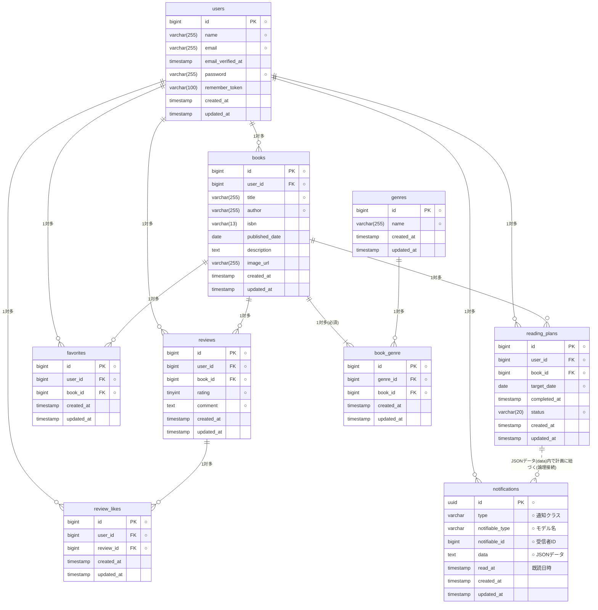

markdown

# プロジェクト名

coachtech_BookShelf 書籍レビューアプリ

## 概要

### プロジェクトの目的

日常の「読みたい本が山積みになってしまう」「計画的に読書が進まない」という課題を解決するために開発した、
**書籍一元管理・読書習慣化支援システム**です。

単に読んだ本を記録するだけでなく、目標日に向けた「読書計画の可視化」や、
Google Books APIと連携した「手軽な書籍登録」、
さらに計画倒れを防ぐ「自動リマインダー通知」を実装することで、
ユーザーが無理なく持続可能な読書習慣を確立することを目的としています。

### 実装機能一覧

ユーザーが快適に読書を管理し、モチベーションを維持するための豊富な機能を搭載しています。

#### 1. ユーザー認証機能

- **アカウント管理**: 新規ユーザー登録、ログイン・ログアウト機能。

#### 2. 書籍・ジャンル管理機能

- **書籍とジャンルの登録**: 新しい書籍の登録、および書籍を分類するためのジャンルの自由な登録。
- **Google Books API 連携**: ISBNコードから、書籍情報（表紙画像、タイトル、著者、説明等）を自動で取得・入力。
- **書籍のお気に入り登録**: 気になる本や何度も読み返したい本を、ワンクリックで「お気に入り」に保存。

#### 3. 読書計画 & リマインダー機能

- **読書計画の策定**: 各書籍に対して「いつまでに読み終えるか」の目標達成予定日を設定。
- **ステータス管理**: 書籍ごとに「進行中」「完了」「期限切れ」の進捗を視覚的に管理。
- **自動リマインダー通知**: 計画のスケジュールや遅れを検知し、ユーザーへ自動で通知。

#### 4. レビュー・ソーシャル機能

- **書籍レビューの投稿**: 読んだ書籍に対して、5段階の星評価（Rating）と感想コメントを記録。
- **レビューへの「いいね」**: 他のユーザーが投稿したレビューに対して、共感や応援の「いいね」を送信。

#### 5. 統計・分析機能（ランキング＆レポート）

- **高評価書籍ランキング**: 全ユーザーのレビューを集計し、平均評価が高い順に上位10件の書籍を一覧表示。
- **マイ読書レポート**: 自身の読書傾向を深く分析できる専用ダッシュボード。
    - **総読了冊数** のカウント表示
    - 自分が付けた **高評価書籍 TOP5** の一覧
    - 読書傾向がわかる **ジャンル別平均評価 TOP5** の視覚化
    - 自分が「今どのようなジャンルや書籍に興味があるか」を客観的に一目で確認可能。

---

## ER図



---

## 環境構築手順

### 1. リポジトリのクローンと移動

```bash
git clone git@github.com:YGyuki/coachtech-BookShelf.git
```

```bash
cd coachtech-BookShelf
```

### 2. 環境設定ファイルの準備

環境に合わせてDB接続情報などを適宜修正してください。

```bash
cp .env.example .env
```

`.env` ファイルを開き、以下の環境変数を設定してください。

```ini
# Google Books API（書籍情報の自動取得等に使用）
# ※各自でGoogle Cloud ConsoleからAPIキーを取得して設定してください
GOOGLE_BOOKS_API_KEY= your_actual_api_key_here
```

### 3. 依存パッケージの初期インストール

```bash
docker run --rm -u "$(id -u):$(id -g)" -v "$(pwd):/var/www/html" -w /var/www/html -e COMPOSER_CACHE_DIR=/tmp/composer_cache laravelsail/php82-composer:latest composer install
```

### 4. Dockerコンテナの起動

```bash
./vendor/bin/sail up -d
```

### 5. アプリケーションキーの生成

```bash
./vendor/bin/sail artisan key:generate
```

### 6. データベース構築（マイグレーションとシーディングの実行）

```bash
./vendor/bin/sail artisan migrate --seed
```

### 7. フロントエンドのセットアップとVite開発サーバーの起動

フロントエンドのパッケージをインストールし、Vite（開発サーバー）を立ち上げます。

```bash
# パッケージのインストール
./vendor/bin/sail npm install

# 開発サーバーの起動（起動したままにしておく必要があります）
./vendor/bin/sail npm run dev
```

---

## 使用技術

- **PHP** 8.5.5
- **Laravel** 10.50.2
- **Laravel Fortify**
- **Tailwind CSS**
- **MySQL** 8.4.9
- **WEB Server** Nginx
- **Build Tool** Vite

---

## 作成者

八木優希

---

## APIエンドポイント一覧

認証が必要なエンドポイント（★）を呼び出す場合は、事前にログインAPIからトークンを取得し、リクエストヘッダーに `Authorization: Bearer <TOKEN>` を含めてください。

### 認証関連 (Authentication)

| HTTPメソッド | URI             | コントローラー / アクション   |             認証             |
| :----------- | :-------------- | :---------------------------- | :--------------------------: |
| `POST`       | `/api/v1/login` | `Api\v1\AuthController@login` |    ログイン・トークン発行    |
| `GET/HEAD`   | `/api/user`     | （Laravelデフォルト）         | ログイン中ユーザー情報の取得 |

### 書籍管理 (Books)

| HTTPメソッド | URI                    | 説明               |                 認証                 |
| :----------- | :--------------------- | :----------------- | :----------------------------------: |
| `GET`        | `/api/v1/books`        | 書籍一覧を取得する |                 不要                 |
| `GET`        | `/api/v1/books/{book}` | 書籍詳細を取得する |                 不要                 |
| `POST`       | `/api/v1/books`        | 書籍を新規登録する |            ★ Sanctum 必須            |
| `PUT`        | `/api/v1/books/{book}` | 書籍を更新する     | ★ Sanctum + BookPolicy（所有者のみ） |
| `DELETE`     | `/api/v1/books/{book}` | 書籍を削除する     | ★ Sanctum + BookPolicy（所有者のみ） |

---

---

## 開発環境URL

- **書籍一覧画面**： http://localhost/books
- **ログイン画面**： http://localhost/login
- **phpMyAdmin（データベース管理）**： http://localhost:8080/
